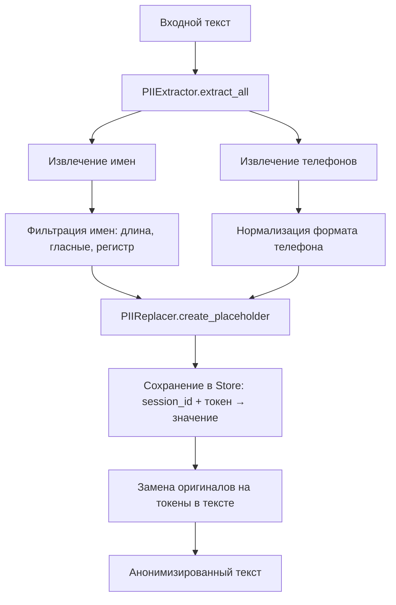
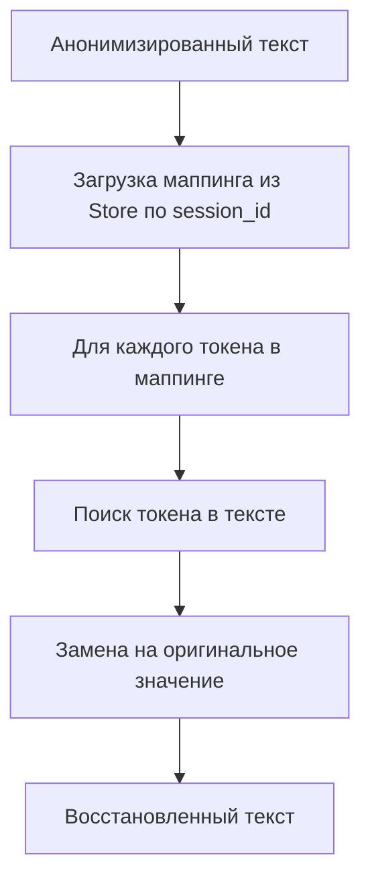
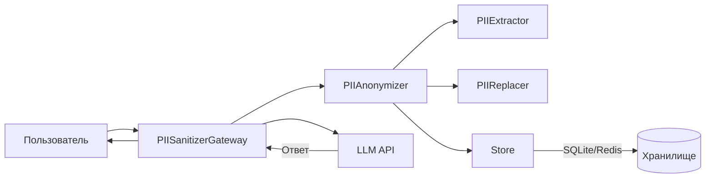

# PII Sanitizer Gateway

Шлюз для анонимизации PII-данных в сообщениях перед отправкой в LLM и восстановления ответов.

## Возможности
- Анонимизация PII-данных (имена, телефоны)
- Интеграция с LLM (OpenAI)
- REST API для обработки текста
- Поддержка хранилищ:
  - SQLite (по умолчанию)
  - Redis (для production)

## Архитектура системы

Система состоит из следующих ключевых компонентов:

### Процесс анонимизации


### Процесс деанонимизации


### Компонентная архитектура


## Быстрый старт

Минимальный пример использования:

```python
from pii_sanitizer.core_api import sanitize, desanitize

# Анонимизация текста
text = "Меня зовут Иван, мой телефон +79161234567."
sanitized_text, mapping, session_id = sanitize(text)

print("Анонимизированный текст:", sanitized_text)
print("Маппинг:", mapping)

# Деанонимизация текста
restored_text = desanitize(sanitized_text, mapping)
print("Восстановленный текст:", restored_text)
```

## Установка

1. Склонируйте репозиторий:
```bash
git clone https://github.com/Vgoroveckiy/Pii_sanitizer.git
cd Pii_sanitizer
```

2. Установите зависимости:
```bash
pip install -r requirements.txt
```

3. Создайте файл `.env` в корне проекта с вашим API-ключом OpenAI:
```env
OPENAI_API_KEY=ваш_ключ_здесь
```

## Конфигурация

Основные настройки находятся в `pii_sanitizer/config.py`:
```python
# Конфигурация LLM
LLM_CONFIG = {
    "type": "openai",  # Тип коннектора
    "params": {
        "model": "gpt-4o-mini",  # Модель LLM
        # Другие параметры (temperature и т.д.)
    }
}
```

## Использование

### Интеграция в ваш проект

```python
from pii_sanitizer.gateway import PIISanitizerGateway

# Инициализация шлюза
gateway = PIISanitizerGateway()

# Обработка сообщения
user_message = "Привет, я Иван, мой телефон +79161234567"
response = gateway.process_message(user_message)

print(response)
```

### Доступные методы

```python
# Инициализация с кастомной конфигурацией
custom_config = {
    "type": "openai",
    "params": {
        "model": "gpt-4-turbo",
        "temperature": 0.7
    }
}
gateway = PIISanitizerGateway(llm_config=custom_config)

# Прямой вызов методов анонимизации
from pii_sanitizer.core_api import sanitize, desanitize

text = "Имя: Мария, Телефон: +79161234567"
sanitized_text, mapping, session_id = sanitize(text)
restored_text = desanitize("Ответ LLM", mapping)
```

Пример работы:
```
Оригинальное сообщение: Привет, я Сергей, мой телефон 8-916-123-45-67
Анонимизированный текст: Привет, я NAME_1, мой телефон PHONE_1
Маппинг: {'NAME_1': 'Сергей', 'PHONE_1': '79161234567'}

Ответ от LLM: Привет, NAME_1! Чем могу помочь?
Восстановленный ответ: Привет, Сергей! Чем могу помочь?
```

## Примеры использования

### CLI приложение
```python
import argparse
from pii_sanitizer.core_api import sanitize

def main():
    parser = argparse.ArgumentParser(description='PII Sanitizer CLI')
    parser.add_argument('text', type=str, help='Text to sanitize')
    args = parser.parse_args()
    
    sanitized, _, _ = sanitize(args.text)
    print("Результат:", sanitized)

if __name__ == "__main__":
    main()
```

### Telegram бот
```python
from telegram import Update
from telegram.ext import Application, MessageHandler, filters
from pii_sanitizer.core_api import sanitize

async def handle_message(update: Update, context):
    text = update.message.text
    sanitized, _, _ = sanitize(text)
    await update.message.reply_text(f"Анонимизировано: {sanitized}")

app = Application.builder().token("YOUR_TOKEN").build()
app.add_handler(MessageHandler(filters.TEXT, handle_message))
app.run_polling()
```

### Веб-приложение (Flask)
```python
from flask import Flask, request, jsonify
from pii_sanitizer.core_api import sanitize

app = Flask(__name__)

@app.route('/sanitize', methods=['POST'])
def sanitize_text():
    text = request.json.get('text')
    sanitized, mapping, session_id = sanitize(text)
    return jsonify({
        'sanitized': sanitized,
        'session_id': session_id
    })

if __name__ == '__main__':
    app.run()
```

## Интеграция в сторонние проекты

Пакет `pii_sanitizer` можно использовать в любых Python-проектах:

1. Установите пакет:
```bash
pip install git+https://github.com/Vgoroveckiy/Pii_sanitizer.git
```

2. Импортируйте основные функции:
```python
from pii_sanitizer.core_api import sanitize, desanitize
```

3. Используйте в своем коде:
```python
def process_user_input(text: str):
    sanitized, mapping, _ = sanitize(text)
    # Ваша бизнес-логика
    return desanitize(processed_text, mapping)
```

## Тестирование

Для проверки работы модуля используйте тестовый клиент:
```bash
python test_gateway.py
```

Пример работы:
```
Введите сообщение: Привет, я Сергей, мой телефон 8-916-123-45-67

Оригинальное сообщение: Привет, я Сергей, мой телефон 8-916-123-45-67

Анонимизированный текст: Привет, я NAME_1, мой телефон PHONE_1
Маппинг: {'NAME_1': 'Сергей', 'PHONE_1': '79161234567'}

Ответ от LLM (2.34 сек): Привет, NAME_1! Чем могу помочь?

Восстановленный ответ: Привет, Сергей! Чем могу помочь?
```

## Настройка хранилища

Система поддерживает два типа хранилищ для маппинга токенов:

### SQLite (по умолчанию)
Для использования SQLite укажите в `pii_sanitizer/config.py`:
```python
STORAGE_TYPE = "sqlite"
DB_PATH = "pii_data.db"  # путь к файлу БД
```

### Redis
Для использования Redis:
1. Установите Redis-сервер
2. Укажите в `pii_sanitizer/config.py`:
```python
STORAGE_TYPE = "redis"
REDIS_CONFIG = {
    "host": "localhost",
    "port": 6379,
    "db": 0,
    "ttl": 600  # время жизни данных в секундах (10 минут)
}
```

### Проверка работы Redis
Убедитесь, что Redis работает:
```bash
redis-cli ping
```
Если ответит `PONG`, то Redis доступен.

Для просмотра данных в Redis:
```bash
redis-cli
KEYS *
HGETALL <ключ>
```

## REST API

Для использования сервиса через REST API:

1. Запустите сервер:
```bash
python app.py
```

или для продакшена

```bash
hypercorn app:app --bind 0.0.0.0:5000
```

2. Используйте следующие эндпоинты:

- Генерация токена:
```bash
POST http://localhost:5000/generate-token
Body: {"scope": "full"}

или

Body: {"scope": "read"}

```

- Обработка текста:
```bash
POST http://localhost:5000/process
Headers: {"X-API-KEY": "токен c доступом full"}
Body: {"text": "Ваш текст с PII данными"}

Ответ:
{
  "sanitized": "Анонимизированный текст",
  "llm_response": "Ответ LLM до восстановления",
  "result": "Финальный результат с восстановленными PII"
}
```

- Проверка статуса:
```bash
GET http://localhost:5000/status
Headers: {"X-API-KEY": "токен c доступом full или read"}
```

- Локальная анонимизация:
```bash
POST http://localhost:5000/anonymize
Headers: {"X-API-KEY": "токен c доступом full"}
Body: {"text": "Ваш текст с PII данными"}

Ответ:
{
  "sanitized": "Анонимизированный текст",
  "session_id": "идентификатор_сессии"
}
```

- Восстановление текста:
```bash
POST http://localhost:5000/restore
Headers: {"X-API-KEY": "токен c доступом read или full"}
Body: {
  "sanitized": "Анонимизированный текст",
  "session_id": "идентификатор_сессии"
}

Ответ:
{
  "restored": "Восстановленный текст"
}
```
Примечание: Сессия хранится 10 минут. По истечении этого времени восстановление будет невозможно.

## Добавление новых коннекторов

1. Создайте новый класс коннектора в `pii_sanitizer/connectors/`, наследуемый от `BaseConnector`
2. Реализуйте метод `send_request(text: str) -> str`
3. Добавьте поддержку в фабрику (`factory.py`)

## Лицензия

Проект распространяется под лицензией MIT.
