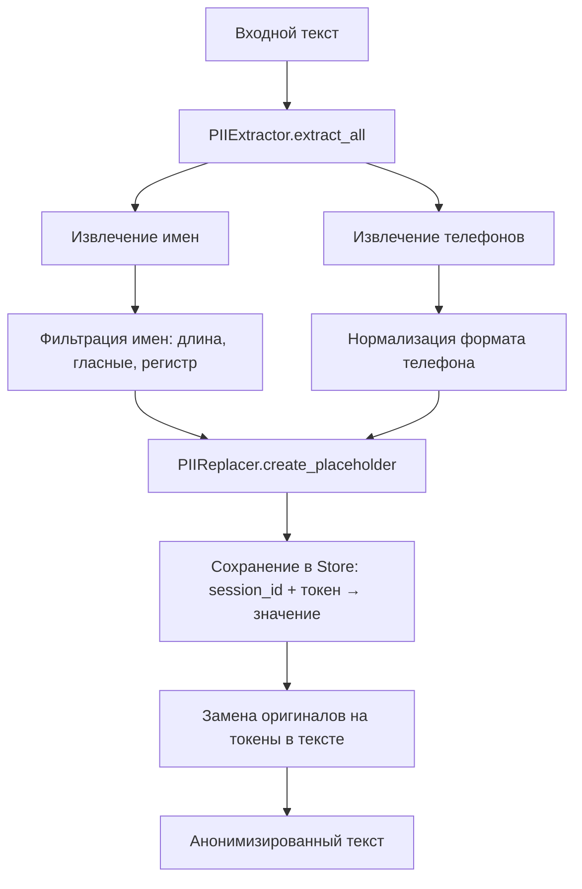
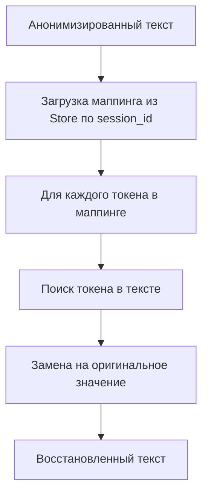
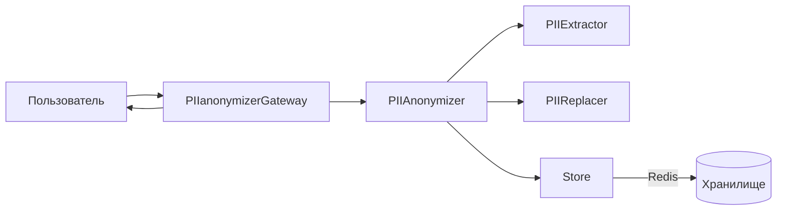

# PII Anonymizer Gateway

Шлюз для анонимизации PII-данных в сообщениях и восстановления ответов.

## Возможности
- Анонимизация PII-данных (имена, телефоны)
- REST API для обработки текста
- Поддержка хранилищ:
  - Redis (для production)

## Архитектура системы

Система состоит из следующих ключевых компонентов:

### Процесс анонимизации


### Процесс деанонимизации


### Компонентная архитектура


## Установка

1. Склонируйте репозиторий:
```bash
git clone https://github.com/Vgoroveckiy/Pii_anonymizer.git
cd Pii_anonymizer
```

2. Установите зависимости:
```bash
pip install -r requirements.txt
```

## Конфигурация

Основные настройки находятся в `pii_anonymizer/config.py`:

### Доступные методы

```python
# Прямой вызов методов анонимизации
from pii_anonymizer.core_api import sanitize, desanitize

text = "Имя: Мария, Телефон: +79161234567"
sanitized_text, mapping, session_id = sanitize(text)
restored_text = desanitize("Ответ LLM", mapping)
```

Пример работы:
```
Оригинальное сообщение: Привет, я Сергей, мой телефон 8-916-123-45-67

Анонимизированный текст: Привет, я NAME_1, мой телефон PHONE_1
Маппинг: {'NAME_1': 'Сергей', 'PHONE_1': '79161234567'}

Ответ от LLM: Привет, NAME_1! Чем могу помочь?
Восстановленный ответ: Привет, Сергей! Чем могу помочь?
```

## Примеры использования

### CLI приложение
```python
import argparse
from pii_anonymizer.core_api import sanitize

def main():
    parser = argparse.ArgumentParser(description='PII anonymizer CLI')
    parser.add_argument('text', type=str, help='Text to sanitize')
    args = parser.parse_args()
    
    sanitized, _, _ = sanitize(args.text)
    print("Результат:", sanitized)

if __name__ == "__main__":
    main()
```

### Telegram бот
```python
from telegram import Update
from telegram.ext import Application, MessageHandler, filters
from pii_anonymizer.core_api import sanitize

async def handle_message(update: Update, context):
    text = update.message.text
    sanitized, _, _ = sanitize(text)
    await update.message.reply_text(f"Анонимизировано: {sanitized}")

app = Application.builder().token("YOUR_TOKEN").build()
app.add_handler(MessageHandler(filters.TEXT, handle_message))
app.run_polling()
```

## Интеграция в сторонние проекты

Пакет `pii_anonymizer` можно использовать в любых Python-проектах:

1. Установите пакет:
```bash
pip install git+https://github.com/Vgoroveckiy/Pii_anonymizer.git
```

2. Импортируйте основные функции:
```python
from pii_anonymizer.core_api import sanitize, desanitize
```

3. Используйте в своем коде:
```python
def process_user_input(text: str):
    sanitized, mapping, _ = sanitize(text)
    # Ваша бизнес-логика
    return desanitize(processed_text, mapping)
```

## Настройка хранилища

Система поддерживает персистентное хранилище для маппинга токенов:

### Redis
Для использования Redis:
1. Установите Redis-сервер
2. Укажите в `pii_anonymizer/config.py`:
```python
STORAGE_TYPE = "redis"
REDIS_CONFIG = {
    "host": "localhost",
    "port": 6379,
    "db": 0,
    "ttl": 600  # время жизни данных в секундах (10 минут)
}
```

### Проверка работы Redis
Убедитесь, что Redis работает:
```bash
redis-cli ping
```
Если ответит `PONG`, то Redis доступен.

Для просмотра данных в Redis:
```bash
redis-cli
KEYS *
HGETALL <ключ>
```

## REST API

Для использования сервиса через REST API:

1. Запустите сервер:
```bash
python anonymizer.py

-- или для продакшена

hypercorn anonymizer:app --bind 0.0.0.0:5000
```

2. Используйте следующие эндпоинты:

- Генерация токена:
```bash
POST http://localhost:5000/generate-token
Body: {"scope": "full"}

или

Body: {"scope": "read"}

```

- Проверка статуса:
```bash
GET http://localhost:5000/status
Headers: {"X-API-KEY": "токен c доступом full или read"}

Ответ

{
  "redis_connected": true,
  "session_ttl_minutes": 10,
  "status": "running"
}


```

- Анонимизация текста:
```bash
POST http://localhost:5000/anonymize
Headers: {"X-API-KEY": "токен c доступом full"}
Body: {"text": "Ваш текст с PII данными"}

Ответ:
{
  "sanitized": "Анонимизированный текст",
  "session_id": "идентификатор_сессии"
}
```

Примечания:
- Обработка выполняется асинхронно, поддерживает высокую нагрузку
- Максимальный размер запроса: 10 МБ

- Восстановление текста:
```bash
POST http://localhost:5000/restore
Headers: {"X-API-KEY": "токен c доступом read или full"}
Body: {
  "sanitized": "Анонимизированный текст",
  "session_id": "идентификатор_сессии"
}

Ответ:
{
  "restored_text": "Восстановленный текст"
}
```
Примечание: Сессия хранится 10 минут. По истечении этого времени восстановление будет невозможно.

## Деплой через Docker Compose

Проект поддерживает развертывание с помощью Docker Compose:

1. Убедитесь, что у вас установлены Docker и Docker Compose
2. Соберите образ приложения:
```bash
docker build -t pii-anonymizer .
```
3. Запустите сервисы:
```bash
docker-compose up -d
```

Сервисы:
- **Redis**: Использует образ Redis 7.2 из приватного реестра
- **Приложение**: Запускает PII Anonymizer на порту 5000 (доступен на хосте через порт 5005)

Конфигурация:
- Redis сохраняет данные в volume `redis_data`
- Приложение зависит от работоспособности Redis
- Healthcheck проверяет доступность Redis каждые 10 секунд

Для остановки сервисов:
```bash
docker-compose down
```

## Лицензия

Проект распространяется под лицензией MIT.
