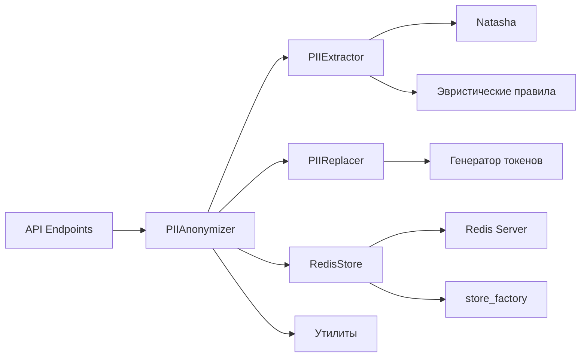

# Техническое задание: PII Anonymizer

## 1. Введение
Проект `pii_anonymizer` предоставляет API для анонимизации и восстановления персональных данных (PII) в текстах. Система идентифицирует и заменяет конфиденциальную информацию (имена, телефоны) на токены, сохраняя оригинальные значения в защищённом хранилище.

## 2. Функциональные требования

### 2.1. Основные функции
- **Анонимизация текста**: Замена PII-данных на уникальные токены
- **Восстановление текста**: Деанонимизация текста по токенам
- **Управление сессиями**: Временное хранение маппинга токен-значение с настраиваемым TTL
- **Проверка статуса**: Мониторинг работоспособности сервиса

### 2.2. API Endpoints
| Метод | Эндпоинт         | Описание                          |
|-------|------------------|-----------------------------------|
| POST  | /generate-token  | Генерация API-токена доступа      |
| POST  | /anonymize       | Анонимизация входного текста      |
| POST  | /restore         | Восстановление оригинального текста |
| GET   | /status          | Проверка статуса сервиса          |

## 3. Архитектура системы

### 3.1. Компоненты


### 3.2. Процесс анонимизации
1. Извлечение сущностей с использованием:
   - **Natasha и эвристического словаря** для распознавания имён
   - **Phonenumbers и эвристических правил** для распознавания телефонов
2. Нормализация телефонных номеров
3. Генерация уникальных токенов
4. Сохранение маппинга в Redis
5. Замена оригинальных значений на токены

### 3.3. Процесс восстановления
1. Загрузка маппинга из Redis
2. Замена токенов на оригинальные значения

## 4. Технологический стек
- **Язык**: Python 3.9+
- **Фреймворк**: Quart (асинхронный)
- **Хранилище**: Redis
- **Анализ текста**:
  - Natasha + эвристический словарь (распознавание имён)
  - Phonenumbers + эвристические правила (телефоны)
- **Дополнительные компоненты**:
  - Генерация токенов (PIIReplacer)
  - Нормализация данных (utils.normalize_phone)
  - Фабрика хранилищ (store_factory)
- **Вспомогательные библиотеки**: 
  - redis-py
  - python-dotenv
  - uvicorn

## 5. Требования к окружению
- Redis 6.0+
- Python 3.9+
- Пакеты из `requirements.txt`

## 6. Запуск проекта

### 6.1. Установка зависимостей
```bash
pip install -r requirements.txt
```

### 6.2. Конфигурация
Настройки Redis задаются в `pii_anonymizer/config.py`:
```python
REDIS_CONFIG = {
    "host": "XXX.XXX.XXX.XXX",
    "port": 6379,
    "db": 1,
    "ttl": 600  # 10 минут
}
```

### 6.3. Запуск сервиса
```bash
python anonymizer.py
```

## 7. Примеры использования

### 7.1. Анонимизация текста
```bash
POST http://localhost:5000/anonymize
Headers: {"X-API-KEY": "токен c доступом full"}
Body: {"text": "Ваш текст с PII данными"}

Ответ:
{
  "sanitized": "Анонимизированный текст",
  "session_id": "идентификатор_сессии"
}
```

### 7.2. Восстановление текста
```bash
POST http://localhost:5000/restore
Headers: {"X-API-KEY": "токен c доступом read или full"}
Body: {
  "sanitized": "Анонимизированный текст",
  "session_id": "идентификатор_сессии"
}

Ответ:
{
  "restored_text": "Восстановленный текст"
}
```

### 7.3 Проверка статуса:
```bash
GET http://localhost:5000/status
Headers: {"X-API-KEY": "токен c доступом full или read"}

Ответ

{
  "redis_connected": true,
  "session_ttl_minutes": 10,
  "status": "running"
}
```

## 8. Развертывание в продакш среде
- Проект оформлен для запуска в Docker-контейнере
- Конфигурация Docker-контейнера в файле `docker-compose.yml`
- Конфигурация содержит сам модуль и базу данных Redis
- Для запуска проекта в Docker-контейнере необходимо выполнить команду:
```bash
docker-compose up -d
```

## 9. Ограничения
- Поддерживаются только русские имена
- Время жизни сессии настраивается через параметр `ttl` в конфигурации Redis

## 10. Контакты
Для технической поддержки обращаться: vgoroveckiy@gmail.com
