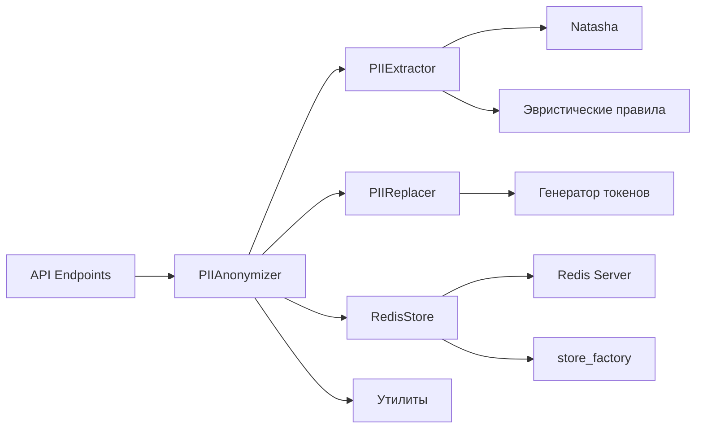

# Техническое задание: PII Anonymizer

## 1. Введение
Проект `pii_anonymizer` предоставляет API для анонимизации и восстановления персональных данных (PII) в текстах. Система идентифицирует и заменяет конфиденциальную информацию (имена, телефоны) на токены, сохраняя оригинальные значения в защищённом хранилище.

## 2. Функциональные требования

### 2.1. Основные функции
- **Анонимизация текста**: Замена PII-данных на уникальные токены
- **Восстановление текста**: Деанонимизация текста по токенам
- **Управление сессиями**: Временное хранение маппинга токен-значение с настраиваемым TTL
- **Проверка статуса**: Мониторинг работоспособности сервиса
- **Авторизированный доступ**: При работе с сервисом требуется токен авторизации

### 2.2. API Endpoints
| Метод | Эндпоинт         | Описание                          |
|-------|------------------|-----------------------------------|
| POST  | /generate-token  | Генерация API-токена доступа      |
| POST  | /anonymize       | Анонимизация входного текста      |
| POST  | /restore         | Восстановление оригинального текста |
| GET   | /status          | Проверка статуса сервиса          |

## 3. Архитектура системы

### 3.1. Компоненты


### 3.2. Процесс анонимизации
1. Извлечение сущностей с использованием:
   - **Natasha и эвристического словаря** для распознавания имён
   - **Phonenumbers и эвристических правил** для распознавания телефонов
2. Нормализация телефонных номеров
3. Генерация уникальных токенов
4. Сохранение маппинга в Redis
5. Замена оригинальных значений на токены

### 3.3. Процесс восстановления
1. Загрузка маппинга из Redis
2. Замена токенов на оригинальные значения

## 4. Технологический стек
- **Язык**: Python 3.9+
- **Фреймворк**: Quart (асинхронный)
- **Хранилище**: Redis
- **Анализ текста**:
  - Natasha + эвристический словарь (распознавание имён)
  - Phonenumbers + эвристические правила (телефоны)
- **Дополнительные компоненты**:
  - Генерация токенов (PIIReplacer)
  - Нормализация данных (utils.normalize_phone)
  - Фабрика хранилищ (store_factory)
- **Вспомогательные библиотеки**: 
  - aioredis (асинхронный Redis-клиент)
  - python-dotenv
  - uvicorn

## 5. Асинхронная архитектура

Система была переработана для полной асинхронной работы:
- Все операции с Redis выполняются через aioredis
- Используется пул соединений (макс. 100 соединений)
- CPU-intensive операции вынесены в отдельные потоки
- Добавлены ограничения:
  - Максимальный размер запроса: 10 МБ
  - Таймауты соединений
  - Ограничение параллельных запросов

## 6. Требования к окружению
- Redis 6.0+
- Python 3.9+
- Пакеты из `requirements.txt`

## 6. Запуск проекта

### 6.1. Установка зависимостей
```bash
pip install -r requirements.txt
```

### 6.2. Конфигурация
Настройки Redis задаются в `pii_anonymizer/config.py`:
```python
REDIS_CONFIG = {
    "host": "XXX.XXX.XXX.XXX",
    "port": 6379,
    "db": 1,
    "ttl": 600  # 10 минут
}
```

### 6.3. Запуск сервиса
```bash
python anonymizer.py
```

## 7. Примеры использования

### 7.1. Анонимизация текста
```bash
POST http://localhost:5000/anonymize
Headers: {"X-API-KEY": "токен c доступом full"}
Body: {"text": "Иван, тел. 89161234567"}

Ответ:
{
  "sanitized": "[NAME_acd41b], тел. [PHONE_92cc5d]",
  "session_id": "eaf696e9-7723-493f-a78a-deca6e2834e2"
}
```

### 7.2. Восстановление текста
```bash
POST http://localhost:5000/restore
Headers: {"X-API-KEY": "токен c доступом read или full"}
Body: 
{
  "sanitized": "[NAME_acd41b], тел. [PHONE_92cc5d]",
  "session_id": "eaf696e9-7723-493f-a78a-deca6e2834e2"
}

Ответ:
{
  "restored_text": "Иван, тел. 89161234567"
}
```

### 7.3 Проверка статуса:
```bash
GET http://localhost:5000/status
Headers: {"X-API-KEY": "токен c доступом full или read"}

Ответ

{
  "redis_connected": true,
  "session_ttl_minutes": 10,
  "status": "running"
}
```

### 7.4 Генерация токена:
```bash
POST http://localhost:5000/generate-token
Body: {"scope": "full"}

или

Body: {"scope": "read"}

ответ:

{
  "token": "токен"
}

```
Токен сохраняется в файл tokens.json в корневой папке проекта


## 8. Развертывание в продакшене

Проект оформлен для запуска в Docker-контейнерах с помощью Docker Compose. Конфигурация включает два сервиса: приложение PII Anonymizer и базу данных Redis.

### Конфигурация Docker Compose

Файл `docker-compose.yml` содержит:

```yaml
services:
  redis:
    image: docker-hub.vgorovetskiy.keenetic.pro/redis:7.2-alpine
    container_name: redis
    restart: unless-stopped
    volumes:
      - ./redis.conf:/usr/local/etc/redis/redis.conf
      - redis_data:/data
    command: redis-server /usr/local/etc/redis/redis.conf
    networks:
      - redis_network
    healthcheck:
      test: ["CMD", "redis-cli", "ping"]
      interval: 10s
      timeout: 5s
      retries: 3

  app:
    image: docker-hub.vgorovetskiy.keenetic.pro/pii_anonymizer:v1.0.1
    container_name: pii-anonymizer-app
    restart: unless-stopped
    ports:
      - "5005:5000"
    depends_on:
      redis:
        condition: service_healthy
    networks:
      - redis_network

volumes:
  redis_data:

networks:
  redis_network:
    driver: bridge
```

Ключевые параметры:
- **Redis**:
  - Используется Alpine-образ Redis 7.2
  - Данные сохраняются в volume `redis_data`
  - Конфигурация задается через `redis.conf`
  - Healthcheck проверяет доступность каждые 10 секунд

- **Приложение**:
  - Запускается на порту 5000 (доступ с хоста через порт 5005)
  - Зависит от работоспособности Redis
  - Использует bridge-сеть для связи с Redis

### Конфигурация Dockerfile

Приложение собирается на основе официального образа Python:

```Dockerfile
FROM docker-hub.vgorovetskiy.keenetic.pro/python:3.11-slim

WORKDIR /app

COPY requirements.txt .
RUN pip install --no-cache-dir -r requirements.txt

COPY . .

CMD ["python", "anonymizer.py"]
```

Этапы сборки:
1. Установка зависимостей из `requirements.txt`
2. Копирование всех файлов проекта
3. Запуск приложения через `anonymizer.py`

### Запуск в production
1. Соберите образ приложения:
```bash
docker build -t pii-anonymizer .
```
2. Запустите сервисы:
```bash
docker-compose up -d
```
3. Для остановки:
```bash
docker-compose down
```

### Мониторинг
- Проверьте состояние сервисов:
```bash
docker-compose ps
```
- Просмотрите логи приложения:
```bash
docker-compose logs app
```

## 9. Ограничения
- Поддерживаются только русские имена
- Время жизни сессии настраивается через параметр `ttl` в конфигурации Redis

## 10. Контакты
Для технической поддержки обращаться: vgoroveckiy@gmail.com
